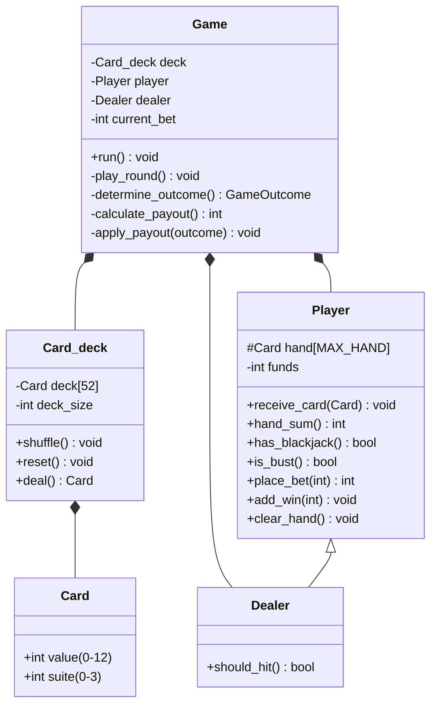
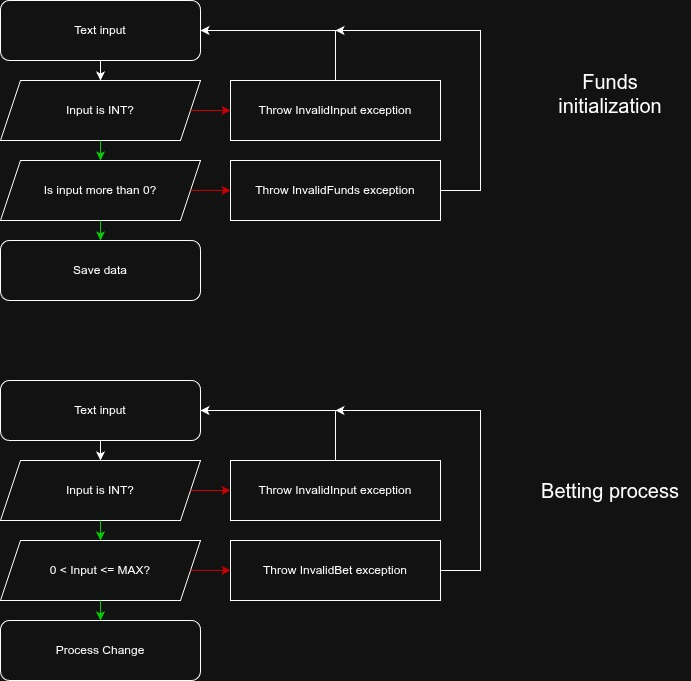

# Detailed Level Design (DLD)

## 1. Overview

The program is structured around `Game` class which orchestrates both interface and game logic. `Game` class includes `Player`, `Dealer`, `Card_deck` classes. 

## 2. UML Class Diagram



## 3. Class Details

### Card_deck

| Attribute | Type | Visibility | Description |
|-----------|------|------------|-------------|
| deck | Card[52] | private | All 52 playing cards |
| deck_size | int | private | Remaining cards (0-52) |

| Method | Return | Responsibility |
|--------|--------|-----------------|
| `shuffle()` | void | Randomize deck using Fisher-Yates algorithm; O(n) |
| `reset()` | void | Reset deck_size to 52 for new round |
| `deal()` | Card | Return next card and decrement counter |

| Constraint | Notes |
|-----------|-------|
| Initialization | Cards populated in constructor (0-51 mapped to suite/value) |
| Shuffle Timing | Called at start of each round after reset() |

### Player

| Attribute | Type | Visibility | Description |
|-----------|------|------------|-------------|
| hand | Card[MAX_HAND] | protected | Current 2-11 cards |
| hand_size | int | protected | Number of cards held |
| funds | int | private | Available funds |

| Method | Return | Responsibility |
|--------|--------|-----------------|
| `receive_card(Card)` | void | Add card to hand if space available |
| `hand_sum()` const | int | Calculate hand value |
| `has_blackjack()` const | bool | True if exactly 2 cards summing to 21 |
| `is_bust()` const | bool | True if hand_sum() > 21 |
| `place_bet(int)` | int | Validate and deduct bet; return 1 if valid, 0 if invalid |
| `add_win(int)` | void | Add payout amount to funds |
| `clear_hand()` | void | Reset hand_size to 0 |

| Validation | Notes |
|-----------|-------|
| Bet validation | bet > 0 AND bet ≤ current funds |
| Hand limit | Cannot exceed MAX_HAND (11 cards) |

### Dealer

| Attribute | Type | Visibility | Description |
|-----------|------|------------|-------------|
| (inherited from Player) | | | Uses hand and hand_size only |

| Method | Return | Responsibility |
|--------|--------|-----------------|
| `should_hit()` | bool | Return true if hand_sum() < 17 (dealer hits on 16 and below) |

### Game

| Attribute | Type | Visibility | Description |
|-----------|------|------------|-------------|
| deck | Card_deck | private | Managed shuffled deck |
| player | Player | private | Player state and funds |
| dealer | Dealer | private | Dealer state |
| current_bet | int | private | Current round's bet amount |

| Method | Return | Responsibility |
|--------|--------|-----------------|
| `run()` | void | Main game loop: init_funds → while(has_funds) play_round → ask_play_again |
| `play_round()` | void | Single round: place_bet → reset/shuffle deck → deal → player_turn → dealer_turn → determine_outcome → apply_payout |
| `display()` const | void | Show current game state (funds, bet, both hands) |
| `init_funds()` | void | Input validation loop for starting funds |
| `place_bet()` | int | Input validation loop for bet placement |
| `deal_initial_cards()` | void | Deal 2 cards to each player/dealer |
| `check_bj()` | bool | Evaluate blackjack; return true if found and round ends |
| `player_turn()` | bool | Loop hit/stand decisions; return true if bust |
| `dealer_turn()` | void | Auto-deal while should_hit() is true |
| `determine_outcome()` | GameOutcome | Compare hands and return the game outcome |
| `calculate_payout()` const | int | Return total payout|
| `apply_payout()` | void | Display result message and update player.funds |

| Separation of Concerns | Notes |
|----------------------|-------|
| Logic Methods | determine_outcome(), calculate_payout() |
| Display Methods | display(), display_round_start(), display_round_result()|
| UI Methods | place_bet(), ask_play_again()|

## 4. Key Algorithms

### Player::hand_sum() - Ace Handling


Algorithm: Calculate blackjack hand value and take into account the Ace value conversion
```cpp
int Player::hand_sum() const {
    int sum = 0;
    int aces = 0;
    for (int i = 0; i < hand_size; i++) {
        sum += card_points(hand[i]);
        if (hand[i].value == 12) {
            aces++;
        }
    }

    while (sum > 21 && aces > 0) {
        sum -= 10;
        aces--;
    }

    return sum;
}
```

Examples:
  [5, 6] → 11
  [K, 5] → 15
  [A, K] → 21 (Ace as 11)
  [A, 5, 5] → 11 (Ace as 1, avoid bust)
  [K, Q, 5] → 25 (BUST)

### Card_deck::shuffle() - Fisher-Yates Algorithm

Algorithm: Randomize deck of cards
```cpp
void Card_deck::shuffle() {
    static std::default_random_engine generator(std::random_device{}());
    for (int i = deck_size - 1; i > 0; i--) {
        std::uniform_int_distribution<int> distribution(0,i);
        int j = distribution(generator);
        swap(&deck[i], &deck[j]);
    }
}
```

Complexity: O(n) time, O(1) space
Called at round start after reset() to get fresh 52-card deck

### Game::determine_outcome() - Hand Comparison

Algorithm: Compare final hands and determine winner

```cpp
Game::GameOutcome Game::determine_outcome() {
    int player_score = player.hand_sum();
    int dealer_score = dealer.hand_sum();
    
    if (player_score > 21) {
        return GameOutcome::PLAYER_BUST;
    }
    else if (dealer_score > 21) {
        return GameOutcome::DEALER_BUST;
    }
    else if (player_score > dealer_score) {
        return GameOutcome::PLAYER_WIN;
    }
    else if (player_score == dealer_score) {
        return GameOutcome::PUSH;
    }
    else {
        return GameOutcome::DEALER_WIN;
    }
}
```


### Game::calculate_payout() - Payout Table

Input: outcome (GameOutcome enum)
Output: Total amount returned to player

| Outcome            | Payout               | Example (bet=$50) |
|--------------------|----------------------|-------------------|
| PLAYER_BLACKJACK   | BET + BET×1.5        | $125              |
| PLAYER_WIN         | BET × 2              | $100              |
| DEALER_BUST        | BET × 2              | $100              |
| PUSH               | BET                  | $50               |
| DEALER_WIN         | 0                    | $0                |
| PLAYER_BUST        | 0                    | $0                |


### Game::play_round() - Round Flow

Algorithm: Execute one complete blackjack round
1. Clear both hands
2. Get valid bet from player
3. Reset & shuffle deck
4. Deal 2 cards to each
5. Display initial state
6. IF blackjack found: apply payout & end
7. Player turn: loop hit/stand until stand or bust
8. IF player not bust:
    Dealer deals while hand sum < 17
9. Display final state
10. Compute outcome
11. Apply payout and display result


## 5. Validation & Constraints

| Component | Constraint | Validation |
|-----------|-----------|------------|
| **Player Funds** | Must be > 0 | `set_funds()` rejects ≤ 0 |
| **Bet Amount** | 0 < bet ≤ available_funds | `place_bet()` deducts and returns success/failure |
| **Hand Size** | Max 11 cards | `receive_card()` ignores overflow |
| **Dealer Rules** | Hits on <17, stands on ≥17 | `should_hit()` enforces rule |
| **Deck** | 52 unique cards | Reset to 52 per round, Fisher-Yates shuffle |
| **Input** | Integer validation + range checking | Input loops with retry on invalid |

## 6. Design Tradeoffs

| Decision | Rationale | Trade-off |
|----------|-----------|-----------|
| Inheritance: Dealer < Player | Reuse hand/funds logic | Dealer doesn't use funds field, minor waste of memory |
| Integer funds only | Avoid floating-point bugs | Cannot represent fractional cents |


## 7. Validation Rules
| Method | Preconditions | Postconditions | Validation Level | Explanation |
| --- | --- | --- | --- | --- |
| UI::get_initial_funds, UI::get_bet | Stream input is valid | Integer is returned | UI | Verifies input is `int` |
| Player::set_funds | Amount parameter provided | Funds stored; exception thrown if ≤ 0 | Logic | Enforces positive funds constraint |
| Player::place_bet | Bet amount and current funds | Bet deducted from funds; exception if invalid | Logic | Ensures bet ≤ available funds before deduction |
| UI::get_player_action | Player's action needed | Returns 1 (Hit) or 2 (Stand) | UI | Validates choice is either one or two with retry loop |
| UI::ask_play_again | Game round complete | Returns true/false for "yes"/"no"/"y"/"n" | UI | Accepts case-sensitive variants; retry on invalid |

## 8. Behavioral Models


## 9. Error and Exception Policy
| Exception Type | Thrown By | Caught At | User Message | Default Action |
| --- | --- | --- | --- | --- |
| InvalidInput | UI number input | UI | "Please enter a valid number." | Retry input |
| InvalidFunds | Player::set_funds | Logic | "Invalid funds amount. Your input: [X]. Please enter a positive amount." | Retry init_funds() |
| InvalidBet | Player::place_bet | Logic | "Invalid bet amount. Your input: [X]. Must be between 1\$ and [MAX]\$." | Retry place_bet() |
| InvalidChoice | UI::get_player_action | UI | "Invalid choice. Your input: [X]. Please enter 1 (Hit) or 2 (Stand)." | Retry action input |
| InvalidResponse | UI::ask_play_again | UI | "Invalid response '[X]'. Please enter 'yes' or 'no'." | Retry play again prompt |
