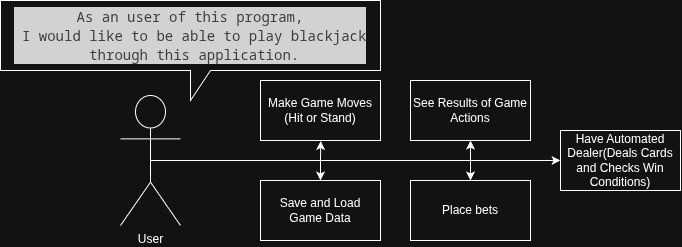

# 1. SW System Overview
## 1.1. Purpose
The program will deliver a minimal implementation of "blackjack" card game. The purpose of the development of this program is to become acquianted with development in C++ language.

## 1.2. Scope
The program will be implemented purely in CLI(Command Line Interface) and will not have any dedicated GUI(Graphical User Interface).

## 1.3. Use-Case Diagram

## 1.4. General Constraints
The project will utilize C++11 standard. Apart from restriction on User Interface, there will also be no networking implementation. All data saving will be done through simple files.

## 1.5. Assumptions and Dependencies
For program to compile, CMake and any C++ compiler supporting C++11 features is required. For running the program, there are no specific system requirements.

# 2. Features / Functions to be Implemented
### User stories
As a user of this program, I would like to be able to play blackjack through this application.
For this, the application must allow me to do the following:
- Deposit initial amount of funds
- Place bets
- Save game data from previous sessions

The program must also autonomously simulate dealer's behavior such as:
- Shuffling the cards at the start of each round
- Dealing the cards
- Determining win conditions
- Calculating correct payouts

## 2.1. Acceptance Criteria
The program must accurately simulate the game of blackjack, following the basic rules of the game. This means that the program must provide correct results to game moves and payout calculations. The game loop must support multiple rounds and handle user input for replay decisions. When saving is implemented, data must be properly saved and loaded.

## 2.2. Implementation Requirements
For shuffling the card deck, Durstenfeld's version of Fisher-Yates shuffling algorithm should be used. For randomization, which is required by aforementioned algorithm, C++ *random* library will be utilized. The deck must be reset and reshuffled at the beginning of each round. Logic and presentation layers should be separate for improved maintainability.

# 3. SW Non-Functional Requirements

## 3.1. Input Validation
The program must:
- Reject invalid input type(int instead of string and vice versa)
- Provide an error message
- Allow to retry user input

## 3.2. Architectural Constraints
Logic, data and presentation will be handled in separate functions to avoid problems with maintainability.

## 3.3. Reliability
Memory is managed correctly, i.e no memory leaks, stack/buffer overflow or broken pointers.

## 3.4. Maintainability
Code split in functions and classes according to responsibility, easier to track down bugs and fix them.

# 4. SW Design Artifacts

## 4.1. CRC Cards (Class–Responsibility–Collaboration)

### *Card* class

| Responsibility | Collaboration | 
| --- | --- |
| Stores data on each playing card: its value and suite | Is a part of *Card_deck* class |

### *Card_deck* class

| Responsibility | Collaboration | 
| --- | --- |
| Stores and manages all playing cards; handles shuffling and dealing | Contains an array of *Card* elements and is a part of *Game* class |
| Resets deck size for fresh rounds | Accessed by *Game* class at round start |

### *Player* class
| Responsibility | Collaboration | 
| --- | --- |
| Stores data related to the player and implements its functions | Is a part of *Game* class|

### *Dealer* class
| Responsibility | Collaboration | 
| --- | --- |
| Stores data related to the dealer and implements its functions | Is a part of *Game* class|

### *Game* class
| Responsibility | Collaboration | 
| --- | --- |
| Manages overall game flow and main game loop | Contains *Player*, *Dealer*, *Card_deck* classes |
| Separates game logic from presentation/UI | Calls logic methods and display methods appropriately |
| Handles round management and replay logic | Manages state between rounds |
